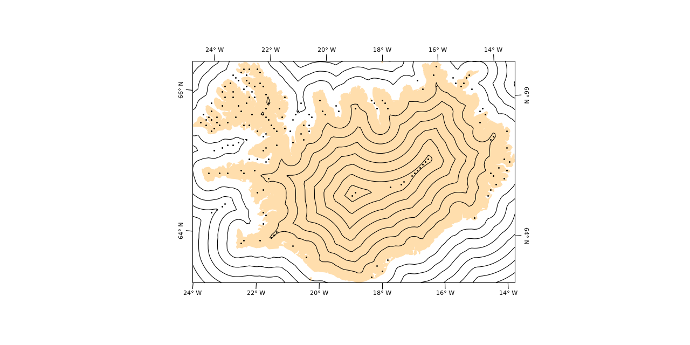

FlotteKarte
===========

**FlotteKarte** is a Python library for quick and versatile cartography
based on PROJ4-string syntax and using Matplotlib, NumPy, and PyPROJ under
the hood.

## Installing
The install system is based on the Meson build system and Python setuptools.
A typical install might be performed by executing the following two commands
(of which the second should suffice on its own) within this project directory:
```sh
./compile.sh
pip install --user
```

### Requirements
The following software has to be installed:
 - PROJ
 - OpenMP
 - NumPy
 - Matplotlib
 - PyProj
 - SciPy
 - Meson
 - Ninja

The following software will be automatically downloaded during Meson installation:
 - [ProjWrapCpp](https://github.com/mjziebarth/ProjWrapCpp)

### Recompiling the backend after an update to PROJ
If the system's PROJ library is updated, FlotteKarte might be linked to a
shared library that is no longer available on the system. Recompiling
FlotteKarte will be necessary. This will automatically be performed at
import time if a failure to load the shared library is detected.

For this reason, Meson and Ninja need to be available on the system if the
PROJ library that FlotteKarte is linked to changes.


## Usage
FlotteKarte is a low-overhead plotting routine. The conceptual idea behind this package
is that a map is fully defined through the 2D cartesian coordinates that result from applying the
map projection to different geographical data. For displaying data on a two-dimensional
canvas, Matplotlib is a powerful tool. Conversion between geographic and projected
coordinates can easily be done using PyProj. The gap between these two powerful tools
and a polished map lies in potential difficulties when translating spherical line topology
to 2D cartesian space, and by introducing typical map decorations such as grids or ticks.
FlotteKarte aims to fill this gap with a simple interface.

FlotteKarte's philosophy is to work completely within the 2D projected coordinates,
that is, very close to the projected data. If projected coordinates of data can be 
obtained, the data can be drawn directly on the underlying Matplotlib Axes. The
`Map` class can then be used to add typical map decoration to that axes using information
that it derives from the numerics of the PROJ projection.

The basic usage pattern is:
```python
# Given:
#   lon:      some longitudes
#   lat:      some latitudes of equal size
#   proj_str: A PROJ4 string

import matplotlib.pyplot as plt
from flottekarte import Map
from pyproj import Proj
fig = plt.figure()
ax = fig.add_subplot(111)

# Project the data:
x,y = Proj(proj_str)(lon,lat)

# Create a map on axis 'ax' from the PROJ string.
# Alternative:
#    mp = Map(proj_str, ax, xlim, ylim)
# where xlim and ylim would be determined through x and y.
mp = Map.for_data(lon, lat, proj_str, ax)

# Scatter the data:
ax.scatter(x,y)
# ... and maybe some other here.

# Plot a grid with 5 degree spacing:
mp.plot_grid(5)

# Complete the plot by this call (ticks every 5 degrees).
mp.plot_axes(5)
```

### Example Map for Iceland
This code uses the file `testing/data/natura-learth/iceland.geojson` to show
the coast line of iceland and compute, in a stereographic projection, the
distance to shoreline:
```python
import numpy as np
import matplotlib.pyplot as plt
from flottekarte import Map, GeoJSON
from pyproj import Proj
from scipy.spatial import KDTree

# The projection we will be working in:
proj_str = '+proj=stere +lon_0=-18 +lat_0=64.5'
proj = Proj(proj_str)

# Load the shoreline (this assumes the GeoJSON is
# in the same folder):
iceland = GeoJSON('iceland.geojson', proj_str)
xlim, ylim = iceland.get_extent()

# Extract the vertices from the PatchCollection:
iceland_xy = [patch.vertices for patch in
              iceland.get_polygon_patches()
                     .get_paths()][0]

# Interpolate the distance to the shoreline
# on a grid:
xg, yg = np.meshgrid(np.linspace(*xlim, 120),
                     np.linspace(*ylim, 80))
zg = np.empty(xg.shape)
tree = KDTree(iceland_xy)
zg.flat[...] = tree.query(np.stack((xg.flat, yg.flat),
                                   axis=1))[0]

# Compute the locations of local distance maxima:
maxima = np.zeros(zg.shape, dtype=bool)
maxima[1:-1,1:-1] =  (zg[:-2,1:-1] < zg[1:-1,1:-1]) \
                   & (zg[2:,1:-1] < zg[1:-1,1:-1]) \
                   & (zg[1:-1,:-2] < zg[1:-1,1:-1]) \
                   & (zg[1:-1,2:] < zg[1:-1,1:-1])
xmaxima = xg[maxima]
ymaxima = yg[maxima]

# Finally, after processing create the map:
fig = plt.figure(dpi=100, figsize=(12.80, 6.40))
ax = fig.add_subplot(111)
mp = Map(proj_str, ax, xlim, ylim, proj=proj)
mp.add_data(iceland, color='navajowhite')
ax.contour(xg, yg, zg, colors='k',
           linewidths=0.8)
ax.scatter(xmaxima, ymaxima, marker='.', color='k',
           s=5)
mp.plot_axes(2)
fig.savefig('iceland-example-map.png')
```
The map should look like the following:




## Documentation
For further documentation, visit the
[FlotteKarte documentation](https://mjziebarth.github.io/FlotteKarte/index.html)

## Citation
If you use FlotteKarte in your scientific publication, please consider citing it with the following citation:

> Ziebarth, Malte Jörn (2022): FlotteKarte - a Python library for quick and versatile cartography based on PROJ4-string. GFZ Data Services. https://doi.org/10.5880/GFZ.2.6.2022.003

You can also consider adding the version tag you used.

## License
This software is licensed under the European Public License (EUPL) version 1.2 or later.

## Changelog
The format is based on [Keep a Changelog](https://keepachangelog.com/en/1.0.0/),
and this project adheres to [Semantic Versioning](https://semver.org/spec/v2.0.0.html).

### [0.2.3] - 2022-08-14
#### Added
- Guard against non-identical version numbers across the project.
- Outsource the `flottekarte` shared object loading check to a subprocess
- Automatic recompilation of the shared object if loading fails.

### [0.2.2] - 2022-08-05
#### Added
- Github pages setup.

#### Changed
- Use `https` by default for ProjWrapCpp subproject.

### [0.2.1] - 2022-08-05
#### Added
- Finalized first documentation.

#### Changed
- Rename compiled extension from `libinverse` to `libflottekarte`
- More informative error messages when importing `libflottekarte` fails.
- More typing information.

### [0.2.0] - 2022-08-04
#### Added
- Added automatic extent computation for some global projections.
- Coordinate labels can be rotated with axis orientation.
- Add AugmentedProj class that automatically falls back to numerical inversion
  if a projection does not come with a defined inversion routine.

#### Changed
- Simplified detection of discontinuities in path processing.
- Reworked the map boundary. It can now follow non-rectangular map shapes
  as defined by violated bijectivity of the map projection.
- Reworked the axes labelling mechanism. Axes are removed if they overlapped,
  based on a weighting criterion, and the labels now follow the (potentially
  non-rectangular) map boundary polygon.
- Fix various bugs.

### [0.1.0] - 2022-06-30
#### Added
 - First version
